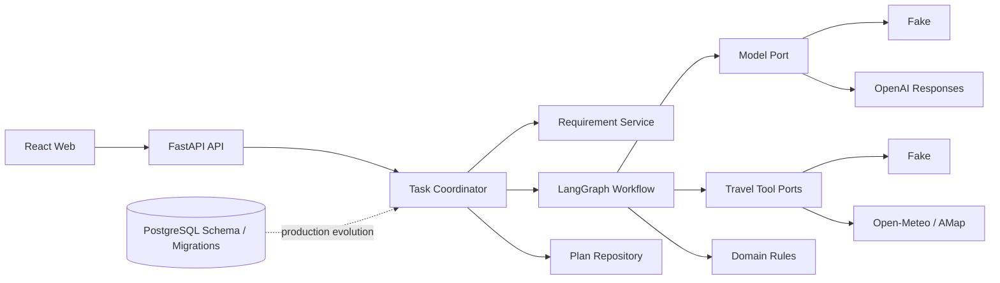

# TripPilot

TripPilot 是一个可控、可测试的国内城市旅行规划 Agent，也是一个面向校招学习的企业级 Agent 工程案例。

它不是把用户输入直接交给大模型：系统先提取并确认结构化需求，再通过显式 LangGraph 状态图加载旅行数据、生成候选、执行确定性预算与约束检查，并在有限次数内自动重规划。结果会展示预算、约束、未知信息和数据来源。

## 核心能力

- 自然语言需求提取、缺失信息追问与人工确认
- 1～3 日结构化时间线、费用分桶、约束和来源
- 最多三份候选的有限重规划，不允许无限 Agent 循环
- Fake / OpenAI 模型适配器
- Fake / Open‑Meteo天气 / 高德地点适配器
- FastAPI 异步任务、取消、轮询、保存与删除
- 不透明 Token、幂等命令、ETag 乐观并发与错误映射
- PostgreSQL 数据模型、Alembic 迁移和 Worker 租约算法
- React + TypeScript 响应式前端
- JSON 日志、敏感信息脱敏、OpenTelemetry HTTP Trace
- 60 场景版本化 Agent Eval 数据集
- Ruff、mypy strict、pytest 覆盖率、前后端 CI 与 Docker Compose

## 架构



项目采用模块化单体与 Ports/Adapters。完整设计见[架构总览](docs/architecture/README.md)，实际完成边界见[实现状态](docs/implementation-status.md)。

## 立即运行

要求：

- Python 3.12
- uv 0.11.32
- Node.js 24

后端：

```bash
cp .env.example .env
uv sync
uv run uvicorn trippilot.interfaces.http.app:create_app --factory --reload
```

前端：

```bash
cd web
npm ci
npm run dev
```

打开 `http://localhost:5173`。默认 Fake 模式无需任何密钥。

也可以使用：

```bash
docker compose up --build
```

然后打开 `http://localhost:8080`。详细步骤与真实适配器配置见[运行手册](docs/runbook.md)。

## 质量检查

```bash
uv run ruff format --check .
uv run ruff check .
uv run mypy src tests
uv run pytest
uv run trippilot-eval
uv run alembic upgrade head --sql > /dev/null
npm run typecheck --prefix web
npm run build --prefix web
```

## 学习入口

从[学习路线](docs/learning/README.md)开始。材料使用三个等级：

- **[必须掌握]**：应能独立解释和修改
- **[应该理解]**：应能说明设计权衡
- **[拓展了解]**：知道适用场景即可

推荐顺序：

1. [项目导览](docs/learning/01-project-tour.md)
2. [Agent 核心](docs/learning/02-agent-core.md)
3. [`asyncio`](docs/learning/03-asyncio.md)
4. [企业工程化](docs/learning/04-enterprise-engineering.md)
5. [测试与评测](docs/learning/05-testing-and-evaluation.md)
6. [面试与简历](docs/learning/06-interview-and-resume.md)

## 产品与工程文档

- [需求规格](docs/requirements.md)
- [验收标准](docs/acceptance-criteria.md)
- [Agent 评测需求](docs/evaluation-requirements.md)
- [架构设计](docs/architecture/README.md)
- [架构决策记录](docs/decisions/README.md)
- [数据字典](docs/data-dictionary.md)
- [开发路线](docs/development-plan.md)
- [贡献与提交规范](CONTRIBUTING.md)

## 当前边界

Portfolio MVP 已完成可运行的规划闭环。完整 PostgreSQL 多 Worker、局部版本修改的执行闭环、60 场景全量行为执行器和正式公网 SLA 属于下一阶段，不在简历中夸大为已交付能力。具体证据和后续工作见[实现状态](docs/implementation-status.md)。
