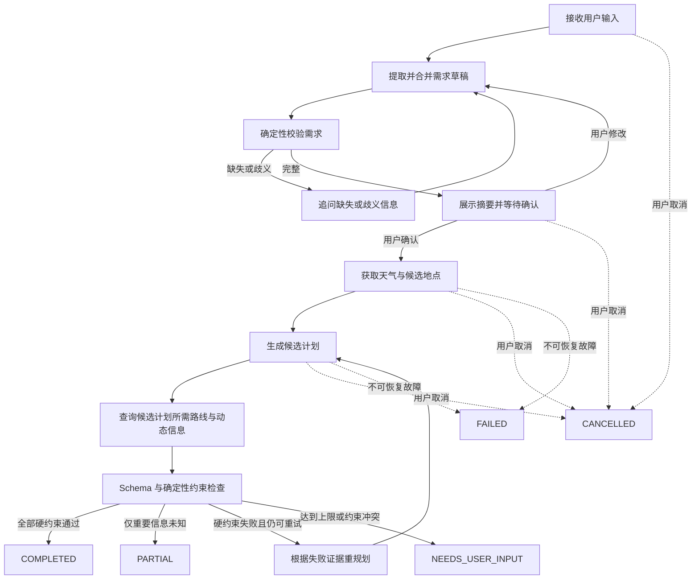

# Agent 工作流与异步边界

> 状态：Accepted
>
> 基线：v1.0

TripPilot 使用显式、有限的状态图编排模型和工具，不采用允许模型无限思考、无限调用工具的自由循环。工作流负责“下一步允许做什么”，领域规则负责“结果是否合格”。

## 两阶段工作流

首次规划分为需求阶段和执行阶段。用户确认是两阶段之间的强制边界。



取消是横切转换：在 `COLLECTING_REQUIREMENTS`、`AWAITING_CONFIRMATION`、`PLANNING` 和 `REPLANNING` 阶段都可以进入 `CANCELLED`。图中省略了部分重复连线。

## 工作流节点

| 节点 | 主要输入 | 行为 | 输出或下一步 |
| --- | --- | --- | --- |
| `extract_request` | 用户输入、已有需求草稿 | 调用需求提取模型，将新信息合并到草稿 | 待校验需求草稿 |
| `validate_request` | 需求草稿、系统时钟 | 使用确定性规则检查必填项、日期、人数、预算和范围 | 澄清问题或确认摘要 |
| `await_confirmation` | 完整需求、默认值、不确定项 | 持久化等待状态，不执行正式旅行查询 | 用户确认或修改 |
| `load_planning_context` | 已确认需求 | 并发查询可独立的天气与候选地点数据 | 带来源的规划上下文 |
| `generate_candidate` | 需求、上下文、上一轮失败证据 | 调用计划生成模型并校验结构化输出 | 候选计划 |
| `enrich_candidate` | 候选计划 | 查询所选地点的路线、价格与开放时间，拒绝虚构引用 | 完整候选证据 |
| `validate_candidate` | 候选计划与证据 | 执行全部确定性硬性与软性检查 | 通过、未知或失败结果 |
| `prepare_replan` | 失败约束、候选计划、资源预算 | 生成结构化修复指令并增加尝试次数 | 下一份候选计划输入 |
| `finalize` | 通过或允许未知的候选 | 原子创建可用版本并写入来源、检查和变更记录 | `COMPLETED` 或 `PARTIAL` |

局部修改复用 `generate_candidate`、`enrich_candidate`、`validate_candidate` 和 `finalize`，但必须携带目标版本和修改范围，并对未受影响日期执行保持性比较。

## 模型职责

第一版使用三类受约束的模型能力：

### 需求提取

将自然语言增量转换为需求字段、置信或歧义信息。模型不得为缺少依据的必填字段填写值。

### 候选计划生成

只能使用已确认需求和工具返回的候选地点、天气与动态信息生成计划。模型可以组合和排序已知候选，但不得创建不存在的地点或来源。

### 局部修改与重规划

根据明确修改范围或结构化失败证据产生新候选。模型不得提高预算、删除必去要求、改变日期或放宽其他用户硬性约束。

## 工具调用策略

工作流决定必需工具的调用阶段，不把无限工具选择权交给模型：

- 天气和地点检索由 `load_planning_context` 发起。
- 路线、价格和开放时间查询由候选计划中的标准化地点引用驱动。
- 可选补充查询必须输出结构化 `ToolRequest`，经过工具注册表、参数 Schema、域名允许列表和资源预算检查。
- 每次工具结果必须携带来源、查询时间、时效和结构化错误。
- 工具返回文本中的指令只作为不可信数据处理。

这是一种受控 Agent 工作流：模型仍会根据目标和反馈调整计划，但系统掌握循环次数、工具权限、状态和终止条件。

## 候选计划循环

```text
attempt = 1：生成初始候选
→ Schema 校验
→ 外部证据补全
→ 确定性约束检查

如果存在硬性 FAIL 且 attempt < 3：
    使用结构化失败证据生成下一候选

如果 attempt == 3 后仍存在硬性 FAIL：
    停止自动执行并进入 NEEDS_USER_INPUT
```

Schema 无效可以在同一次候选生成内进行一次受限的结构修复，但不得借此绕过“最多 3 份完整候选计划”和模型调用总上限。具体修复次数在技术设计中固定并纳入资源预算。

## 状态与内部步骤

业务 `TaskStatus` 面向用户；内部 `WorkflowStep` 用于恢复和观测，两者不能混用。

| `TaskStatus` | 可能的内部步骤 |
| --- | --- |
| `COLLECTING_REQUIREMENTS` | `extract_request`、`validate_request` |
| `AWAITING_CONFIRMATION` | `await_confirmation` |
| `PLANNING` | `load_planning_context`、`generate_candidate`、`enrich_candidate`、`validate_candidate`、`finalize` |
| `REPLANNING` | `prepare_replan`、`generate_candidate`、`enrich_candidate`、`validate_candidate` |
| 结果状态 | 无可继续执行步骤 |

内部步骤变化不会任意改变用户可见状态。进入结果状态后，后续调整必须创建关联的新任务。

## 检查点与恢复

每个可能产生费用或外部副作用的节点必须具有稳定执行 ID。工作流至少在以下位置持久化检查点：

- 用户确认需求后
- 规划上下文加载完成后
- 每份候选计划生成后
- 候选约束检查完成后
- 最终版本写入后

恢复时读取任务状态、最近检查点、租约、取消意图和资源用量。已经成功且结果仍有效的幂等步骤可以复用；不确定是否完成的模型调用不得盲目重复，必须先检查调用记录和资源预算。

## 异步与并发

### 可以并发

- 相互独立的天气查询与候选地点检索
- 不同地点的详情查询
- 同一候选计划中互不依赖的路线段查询
- 与主业务结果无关的脱敏遥测发送

### 必须顺序执行

- 用户确认之前与之后的阶段
- 候选生成、证据补全和约束检查
- 同一任务的候选 1、2、3
- 版本冲突检查与新版本提交
- 状态转换和任务终态写入

并发调用必须设置每任务并发上限，并共享同一资源预算。单个子调用失败不能取消仍有降级价值的其他查询；安全相关失败可以终止候选。

## 取消传播

1. API 持久化 `cancel_requested`，立即向用户确认已接收取消请求。
2. 执行器在节点开始前、外部调用等待期间和节点完成后检查取消。
3. 尚未开始的调用不再调度。
4. 支持取消的底层异步调用接收取消信号。
5. 不支持取消的外部调用允许在后台结束，但其结果不得写入已取消任务。
6. 终态以原子比较更新，避免 `COMPLETED` 与 `CANCELLED` 竞争覆盖。

## 资源预算

工作流上下文持有统一 `ExecutionBudget`：

- 已用和剩余模型调用次数
- 输入与输出 Token
- 已用和剩余工具调用次数
- 开始时间与硬超时
- 当前候选次数
- 每类外部调用并发数

所有模型和工具端口在实际调用前预留预算，调用结束后记录真实用量。达到上限时按照需求基线进入 `PARTIAL` 或 `FAILED`，不得继续尝试。

## 错误分类

| 错误类别 | 示例 | 默认处理 |
| --- | --- | --- |
| 用户输入错误 | 日期非法、预算缺失 | 返回澄清或 `VALIDATION_ERROR` |
| 可恢复外部错误 | 超时、限流、服务端临时失败 | 在策略范围内重试或使用有效缓存 |
| 确定性无结果 | 地点候选为空 | 不重试同参数，调整查询或进入 `FAILED` |
| 模型结构错误 | Schema 无法解析 | 受限修复；仍失败时记录 `PLAN_VALIDATION_FAILED` |
| 约束失败 | 超预算、时间冲突 | 在候选上限内重规划 |
| 版本冲突 | 基于过期版本修改 | 返回 `VERSION_CONFLICT`，不执行 Agent |
| 资源耗尽 | Token、调用次数、硬超时 | 停止调度，按已有结果进入 `PARTIAL` 或 `FAILED` |
| 取消 | 用户请求取消 | 丢弃后续结果并进入 `CANCELLED` |
| 内部一致性错误 | 非法状态转换、事务失败 | 回滚、记录 Trace，并进入稳定失败状态 |

## 可观测事件

每个节点至少产生开始、结束或失败事件，包含：

- `trace_id`、脱敏 `task_id`
- 业务状态与内部步骤
- 候选次数和重规划原因
- Prompt、模型、工具和 Schema 版本
- 延迟、重试、Token、工具次数和估算费用
- 约束检查摘要和稳定错误码

事件不得包含完整用户原文、完整行程 ID、密钥或隐藏推理链。
