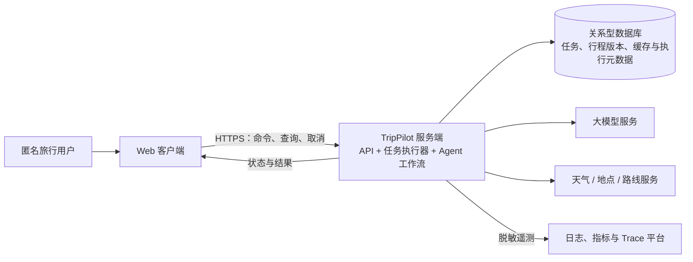
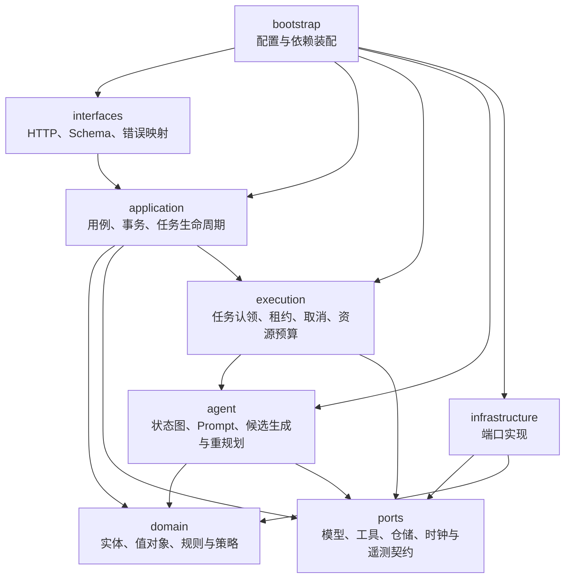

# 容器与模块设计

> 状态：Accepted
>
> 基线：v1.0

本文件将 TripPilot 系统边界拆分为可运行容器，并定义服务端模块职责、依赖方向、数据所有权和任务执行方式。

## 运行容器



### Web 客户端

负责需求输入、确认、状态刷新、取消、行程展示和局部修改。客户端不保存权威任务状态，不执行预算或约束判断，也不直接访问模型和旅行工具。

客户端通过任务 ID 查询进度。长任务不要求单个 HTTP 请求保持连接到规划结束；流式进度可以后续增强，但不能成为正确性的前提。

### TripPilot 服务端

服务端是模块化单体的主要运行单元，负责：

- HTTP API 与输入输出 Schema
- 业务用例、事务和权限边界
- 持久化任务执行与取消信号
- Agent 状态图和资源预算
- 确定性领域规则
- 模型、工具、数据库和遥测适配器

第一版默认在一个服务端实例中同时运行 API 与任务执行器。代码结构必须允许以后从同一发布单元启动独立执行器，而不改变业务和 Agent 模块。

### 关系型数据库

数据库是任务和行程的权威存储，负责：

- 规划任务、确认快照和任务结果
- 不可变行程版本与变更记录
- 幂等键、版本号和任务租约
- 匿名行程访问标识的安全摘要
- 外部工具缓存、来源和时效
- Prompt、模型、工具和代码版本引用

日志、Trace、客户端缓存和模型上下文都不是权威业务存储。

## 服务端模块



箭头表示编译期依赖。`bootstrap` 是唯一允许了解所有具体实现并完成依赖装配的模块。

### `interfaces`

职责：

- HTTP 路由、请求与响应 Schema
- 身份与匿名访问凭证提取
- 输入大小和基础格式校验
- 应用错误到稳定 HTTP 错误的映射

禁止：

- 直接调用模型或外部旅行服务
- 编写预算、时间和版本业务规则
- 直接操作数据库会话

### `application`

职责：

- 实现创建任务、确认需求、查询状态、取消、修改、保存和删除等用例
- 定义事务边界与幂等语义
- 协调领域对象、仓储端口和任务执行
- 校验当前任务状态是否允许执行该命令

禁止：

- 依赖具体 Web 框架、数据库驱动或模型 SDK
- 在用例中拼接供应商请求

### `execution`

职责：

- 从持久化任务记录认领可执行任务
- 维护执行租约，避免同一任务被并发执行
- 在节点边界检查取消信号、硬超时和资源配额
- 将未处理异常映射为稳定终态
- 进程重启后处理过期租约，避免任务永久停留在执行状态

任务执行器不判断旅行计划是否合理，该判断属于 `domain`。

### `agent`

职责：

- 执行显式 Agent 状态图
- 构建版本化 Prompt 和最小模型上下文
- 调用模型与旅行工具端口
- 校验模型结构化响应
- 根据约束证据进行有限重规划
- 生成用户可见的简要决策理由，不暴露隐藏推理链

禁止：

- 绕过领域规则直接将候选计划标记为成功
- 直接使用模型 SDK、数据库驱动或任意网络请求
- 由模型自行决定任务状态、版本号或资源上限

### `domain`

职责：

- 旅行需求、计划、时间线、预算、来源、约束和版本等领域模型
- 日期、金额、时间重叠、行程强度和预算规则
- 状态转换、版本递增、来源时效和约束优先级
- 不依赖 I/O 的纯业务策略

`domain` 是依赖方向的最内层，不得导入 `interfaces`、`application`、`agent`、`execution` 或 `infrastructure`。

### `ports`

定义系统需要但不拥有实现的契约：

- `ModelPort`
- `WeatherPort`
- `PlacePort`
- `RoutePort`
- `TaskRepository`
- `PlanRepository`
- `UnitOfWork`
- `TaskExecutorPort`
- `TelemetryPort`
- `Clock`
- `IdGenerator`

端口由使用方拥有，基础设施只负责实现。端口输入输出使用领域对象或稳定 DTO，不暴露供应商 SDK 类型。

### `infrastructure`

职责：

- 模型供应商适配器
- 模拟与真实旅行工具适配器
- 数据库仓储与事务实现
- 缓存、系统时钟、安全随机 ID 和遥测实现

基础设施错误必须转换为系统定义的错误分类，不能把 SDK 异常直接传播给应用层或用户。

### `bootstrap`

负责读取环境配置、创建具体适配器、注册工具、装配依赖并启动运行角色。环境差异只能改变装配结果，不能通过业务代码中的大量条件分支实现。

## 建议的代码目录

```text
src/trippilot/
├── bootstrap/
├── interfaces/
│   └── http/
├── application/
│   ├── commands/
│   ├── queries/
│   └── services/
├── execution/
├── agent/
│   ├── workflows/
│   ├── prompts/
│   └── schemas/
├── domain/
│   ├── models/
│   ├── value_objects/
│   ├── services/
│   ├── policies/
│   └── errors/
├── ports/
└── infrastructure/
    ├── llm/
    ├── tools/
    ├── persistence/
    └── telemetry/
```

测试目录按照同样边界组织，并额外包含契约测试、集成测试、端到端测试和 Agent 评测数据。

## 持久化任务执行

正式规划不依赖进程内存中的临时任务作为唯一状态：

1. 应用用例在事务中持久化任务状态和执行意图。
2. 执行器使用原子认领或行锁获取任务，并写入有限期租约。
3. 每个工作流节点完成后写入检查点、资源用量和状态事件。
4. 取消请求持久化取消意图；执行器在 I/O 和节点边界检查。
5. 进程异常退出后，过期租约由恢复流程处理。
6. 可安全重试的步骤使用幂等键；不可安全恢复时进入 `FAILED` 并允许用户创建新任务。

第一版可以在同一服务端进程运行认领循环。将来拆分独立执行进程时，任务和领域契约不变。

## 数据所有权

| 数据 | 权威所有者 | 说明 |
| --- | --- | --- |
| 需求草稿与确认快照 | `application` | Agent 只能读取已确认快照开始正式规划 |
| 任务状态与取消意图 | `application` / `execution` | 只能通过状态转换策略修改 |
| 候选计划 | `agent` 执行上下文 | 未通过检查前不是可展示行程版本 |
| 约束结果 | `domain` | Agent 不得伪造 `PASS` |
| 可用行程版本 | `application` | 在事务中原子创建，不原地覆盖 |
| 工具来源与缓存 | `infrastructure` | 必须遵守领域定义的时效策略 |
| Trace 与指标 | `infrastructure` | 只用于观测，不作为业务事实 |

## 模块边界验证

- 使用静态依赖规则阻止 `domain` 导入外层模块。
- 使用端口契约测试验证模拟和真实适配器。
- 使用架构测试阻止 API 直接访问数据库或模型 SDK。
- 使用单元测试在无网络、无数据库、无模型环境下验证领域规则。
- 使用集成测试验证应用事务、任务认领和版本原子性。
