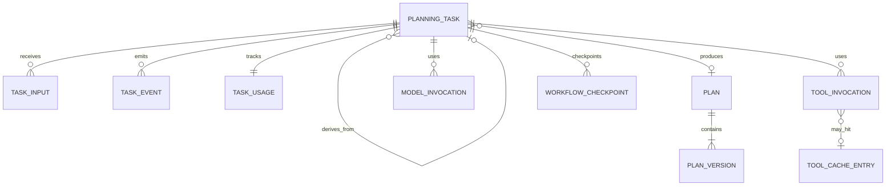

# 数据与持久化设计

> 状态：In Review
>
> 候选基线：v1.0

本文件将需求数据字典映射为持久化边界。业务字段仍以 [数据字典](../data-dictionary.md) 为准，本文件关注表、事务、版本、令牌、任务执行和保留策略。

## 设计原则

1. PostgreSQL 是任务和行程版本的权威存储。
2. 业务状态、并发字段和查询索引使用关系列。
3. 完整需求快照与 TripPlan 聚合使用版本化 JSONB。
4. 已发布行程版本不可原地修改。
5. 工作流 Checkpoint 不能替代业务表。
6. 原始自然语言只在完成提取所需的短期范围内保留。
7. 数据删除必须同时覆盖业务数据、工作流检查点和相关缓存引用。

## 逻辑关系



`WORKFLOW_CHECKPOINT` 代表 LangGraph 管理的逻辑表组，具体物理表由 Checkpointer 迁移创建，不由业务 ORM 直接修改。

## 核心表

### `planning_tasks`

| 字段 | 类型 | 约束或用途 |
| --- | --- | --- |
| `id` | UUID | 内部主键，同时作为 LangGraph `thread_id` |
| `access_token_hash` | bytes | 任务访问令牌摘要，原文不入库 |
| `status` | enum/text | `TaskStatus`，数据库检查约束 |
| `workflow_step` | text/null | 最近内部节点 |
| `request_draft` | JSONB | 允许缺失字段的需求草稿 |
| `confirmed_request` | JSONB/null | 用户确认后的完整快照 |
| `parent_task_id` | UUID/null | 修改或继续决策时关联原任务 |
| `result_plan_id` | UUID/null | 成功产生的行程 |
| `result_plan_version` | integer/null | 当前任务产生的版本 |
| `attempt_number` | smallint | 0～3 |
| `cancel_requested` | boolean | 持久化取消意图 |
| `error_code` | text/null | 稳定错误码 |
| `error_message` | text/null | 已脱敏用户可读信息 |
| `lease_owner` | text/null | 当前执行器实例 |
| `lease_expires_at` | timestamptz/null | 任务租约 |
| `next_run_at` | timestamptz/null | 重试或恢复调度时间 |
| `row_version` | integer | 乐观并发控制 |
| `created_at` | timestamptz | 创建时间 |
| `updated_at` | timestamptz | 最近更新时间 |
| `finished_at` | timestamptz/null | 结果状态时间 |

关键约束：

- `attempt_number BETWEEN 0 AND 3`
- 结果状态必须具有 `finished_at`
- `COMPLETED` 或 `PARTIAL` 必须引用结果版本
- 认领任务时原子更新租约
- 结果状态不能再次被认领

### `task_inputs`

保存尚未完成结构化提取的短期用户输入：

| 字段 | 说明 |
| --- | --- |
| `id` | UUID |
| `task_id` | 所属任务 |
| `sequence` | 输入顺序 |
| `encrypted_content` | 应用层加密后的原始文本 |
| `processing_status` | `PENDING`、`PROCESSED`、`FAILED` |
| `expires_at` | 短期自动删除时间 |

完成提取和草稿合并后尽快删除 `encrypted_content`。匿名保存不会复制该表内容，日志和 Trace 不记录原文。

### `plans`

| 字段 | 类型 | 说明 |
| --- | --- | --- |
| `id` | UUID | 内部主键 |
| `access_token_hash` | bytes | 匿名访问令牌摘要 |
| `latest_version` | integer | 当前最新版本 |
| `expires_at` | timestamptz | 保留期限 |
| `deleted_at` | timestamptz/null | 软删除标记，异步物理清理 |
| `created_at` | timestamptz | 创建时间 |
| `updated_at` | timestamptz | 最近访问或修改时间 |

令牌使用安全随机源生成，至少 128 位不可预测性。数据库只保存带服务器端 Pepper 的摘要，比较使用恒定时间函数。

### `plan_versions`

| 字段 | 类型 | 说明 |
| --- | --- | --- |
| `plan_id` | UUID | 联合主键 |
| `version` | integer | 联合主键，从 1 递增 |
| `created_by_task_id` | UUID | 产生该版本的任务 |
| `based_on_version` | integer/null | 修改所基于的版本 |
| `request_snapshot` | JSONB | 已确认需求 |
| `plan_document` | JSONB | 完整 TripPlan 聚合 |
| `schema_version` | text | 文档 Schema 版本 |
| `content_hash` | bytes | 规范化内容摘要 |
| `created_at` | timestamptz | 版本创建时间 |

创建新版本的事务：

1. 锁定 `plans` 当前行。
2. 比较 `latest_version` 与请求的基础版本。
3. 不相等时返回 `VERSION_CONFLICT`。
4. 插入 `plan_versions` 新行。
5. 更新 `plans.latest_version`。
6. 写入任务结果与必要事件。
7. 一次提交；任一步失败则全部回滚。

### `task_usage`

按任务保存权威资源汇总：

- 模型调用次数
- 输入、输出和缓存 Token
- 工具调用次数
- 缓存命中次数
- 候选计划次数
- 估算模型费用
- 工作流开始、运行和等待时长

资源预留与实际用量更新必须使用原子操作，防止并发工具调用突破上限。

### `model_invocations`

保存复现和成本所需的元数据，不保存隐藏推理链：

- `task_id`、`workflow_step`、`attempt_number`
- `provider`、`model_requested`、`model_resolved`
- `prompt_version`、`schema_version`
- 输入内容摘要、输出内容摘要
- Token、延迟、状态和稳定错误
- 供应商请求 ID 的脱敏或受限引用

### `tool_invocations`

- `task_id`、工具名、工具版本
- 规范化参数摘要
- 来源数量、缓存命中
- 延迟、重试次数、状态和错误类别

工具原始文本只在形成业务结果和来源所必需时进入计划或缓存，不复制到普通事件。

### `tool_cache_entries`

| 字段 | 说明 |
| --- | --- |
| `cache_key` | 工具、版本和规范化输入的摘要 |
| `tool_name` / `tool_version` | 工具标识 |
| `input_hash` | 输入摘要 |
| `result_document` | 结构化结果 JSONB |
| `source_records` | 来源 JSONB |
| `fetched_at` / `expires_at` | 查询和过期时间 |
| `freshness_class` | 天气、路线、价格或地点 |

过期缓存可以用于历史证据，但不能作为最新事实返回 `PASS`。

### `task_events`

保存少量、脱敏、可重放的业务事件，例如：

- 状态变化
- 用户确认
- 取消请求
- 候选检查完成
- 新版本提交
- 稳定错误终止

高体量性能 Trace 发送到遥测平台，不全部复制到业务数据库。

### `idempotency_records`

| 字段 | 说明 |
| --- | --- |
| `scope` | 命令类型与令牌主体 |
| `key_hash` | `Idempotency-Key` 摘要 |
| `request_hash` | 规范化请求摘要 |
| `response_status` / `response_document` | 首次结果 |
| `resource_id` | 创建的任务或版本 |
| `expires_at` | 自动清理时间 |

同一幂等键对应不同请求摘要时返回冲突，不得复用第一次结果。

## LangGraph Checkpoint

- 使用 `AsyncPostgresSaver`。
- `thread_id` 使用内部任务 UUID，不使用匿名访问令牌。
- Checkpoint 保存工作流恢复状态，不保存数据库连接、SDK 客户端或密钥。
- 业务结果仍从 `planning_tasks`、`plans` 和 `plan_versions` 读取。
- 任务删除和保留期限清理必须清除对应 Checkpoint。
- Checkpoint Schema 升级需要兼容策略或明确使旧任务失败，不允许静默误读。

## 任务认领与租约

执行器在短事务中使用符合以下语义的查询：

```sql
SELECT id
FROM planning_tasks
WHERE status IN ('PLANNING', 'REPLANNING')
  AND cancel_requested = false
  AND next_run_at <= now()
  AND (lease_expires_at IS NULL OR lease_expires_at < now())
ORDER BY next_run_at, created_at
FOR UPDATE SKIP LOCKED
LIMIT :batch_size;
```

随后写入 `lease_owner` 和 `lease_expires_at` 并提交。模型与工具网络调用不得持有数据库事务或行锁。

执行器定期续租。只有持有有效租约的执行器可以提交节点检查点；租约丢失后必须停止写入。

## 索引

至少包含：

- `planning_tasks(status, next_run_at)` 的部分索引
- `planning_tasks(lease_expires_at)` 的执行恢复索引
- `planning_tasks(parent_task_id)`
- `planning_tasks(access_token_hash)` 唯一索引
- `plans(expires_at)` 的清理索引
- `plans(access_token_hash)` 唯一索引
- `plan_versions(plan_id, version)` 唯一索引
- `model_invocations(task_id, created_at)`
- `tool_invocations(task_id, created_at)`
- `tool_cache_entries(cache_key)` 唯一索引
- `tool_cache_entries(expires_at)`

仅在具有明确查询需求时为 JSONB 增加 GIN 或表达式索引。

## 删除与保留

### 任务数据

- 未保存任务按配置的短期保留期清理。
- `task_inputs.encrypted_content` 在提取完成后优先删除。
- 调试失败样本进入评测集前必须人工脱敏和重新标注，不直接复制用户输入。

### 匿名行程

- 默认保留 30 天。
- 成功重新打开可以延长到最近访问后 30 天。
- 删除后立即阻止访问，并在清理任务中级联删除版本、Checkpoint 和相关业务事件。
- 不存在、过期和删除使用相同外部错误。

### 遥测

遥测保留独立于业务保留策略，但必须只包含脱敏数据。删除业务行程后，不要求删除不再能关联用户或行程的聚合指标。

## 迁移策略

- Alembic 管理所有业务 Schema。
- 每个迁移提供升级逻辑；破坏性降级可以明确不支持，但必须记录恢复方案。
- 部署前运行 `alembic check` 或等价漂移检查。
- JSONB 文档包含 `schema_version`，读取时执行显式兼容或迁移。
- 数据库迁移和应用发布顺序遵循先兼容、后切换、最后清理。
