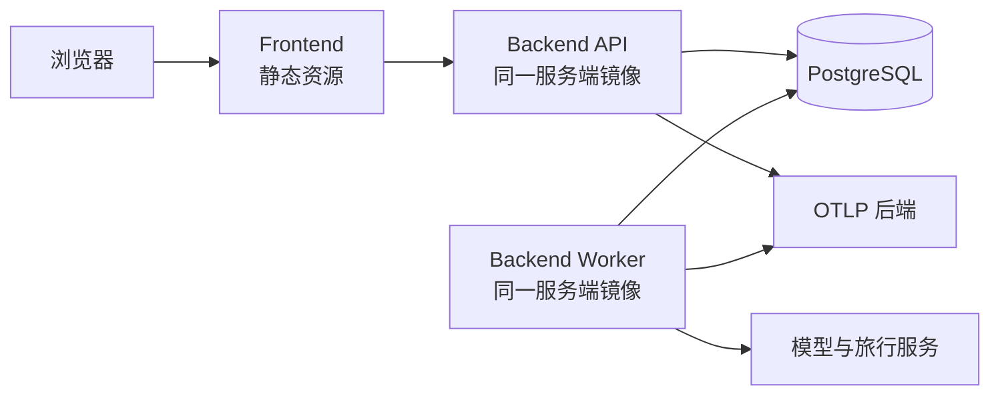

# 部署设计

> 状态：Accepted
>
> 基线：v1.0

部署设计保证本地、CI、集成和演示环境使用同一构建来源，同时让没有真实模型密钥的开发者也能运行核心系统。

## 构建产物

| 产物 | 内容 |
| --- | --- |
| `trippilot-backend` 镜像 | API、任务执行器、Agent、领域和适配器 |
| `trippilot-frontend` 静态产物或镜像 | React 构建结果与静态服务器 |
| Alembic 迁移 | 与服务端镜像同一代码版本 |
| `uv.lock` | Python 完整依赖锁 |
| `package-lock.json` | 前端完整依赖锁 |
| Prompt 与 Schema | 随服务端镜像版本化发布 |
| 评测报告 | 关联候选 Commit 的 CI Artifact |

服务端 API 与 Worker 使用同一镜像，通过启动命令选择运行角色。

## 环境

### 本地开发

Docker Compose 提供：

- PostgreSQL
- Backend Combined 模式
- Frontend Dev Server
- 可选本地遥测查看器

默认使用 Fake Model 和 Fake Tools。开发者可以通过显式环境配置启用真实适配器。

### CI

- 使用临时 PostgreSQL Service。
- 默认禁止外网模型与旅行服务调用。
- 运行迁移、单元、属性、工作流、契约、集成和 API 测试。
- 构建前后端镜像。
- 真实模型评测使用受保护的独立 Workflow，不在外部贡献 PR 上运行。

### 集成环境

- 使用真实模型和至少真实天气、地点或路线服务。
- 凭证来自平台 Secret。
- 使用独立数据库和限额较低的供应商项目。
- 用于契约验证、人工演示预检和少量真实评测。

### 演示环境



演示环境可以先将 API 与 Worker 合并为一个实例；当平台支持多进程角色时，使用同一镜像分开运行。业务和工作流契约不变。

## 启动角色

### API

- 接收命令与查询。
- 不直接执行完整规划。
- 创建任务、持久化输入和返回访问令牌。
- 提供 Liveness、Readiness 和 OpenAPI。

### Worker

- 认领持久化任务。
- 执行 LangGraph 工作流。
- 续租、检查取消、写入 Checkpoint 和终态。
- 不对公网暴露业务端口。

### Combined

本地简化模式，在一个进程生命周期内启动 API 和执行循环。Combined 仍使用数据库任务和 Checkpoint，禁止仅依赖内存队列。

## 健康检查

| 端点 | 含义 |
| --- | --- |
| `/health/live` | 进程事件循环可响应，不检查外部供应商 |
| `/health/ready` | 配置合法、数据库可用、迁移版本兼容 |
| `/health/startup` | 启动初始化完成 |

模型和旅行服务不可用不直接使 API Readiness 失败，否则供应商故障会放大为整个服务下线。工具健康通过独立指标和任务降级表达。

## 数据库迁移

1. 构建镜像。
2. 在部署新应用前运行一次迁移 Job。
3. 迁移必须向前兼容当前和新版本应用。
4. 迁移成功后切换 API 和 Worker。
5. 验证健康与烟雾测试。
6. 最后清理不再使用的字段。

多个 API 或 Worker 实例不得同时自动运行迁移。

## 配置

使用分层环境配置：

- 非敏感默认值在版本化配置模型中声明。
- 环境变量覆盖部署差异。
- Secret 只由运行平台注入。
- 启动时使用严格 Pydantic Settings 校验。
- 未识别配置项在 CI 和演示环境中视为错误。

配置至少覆盖：

- 数据库连接池
- 模型和工具适配器
- 模型名、推理强度和 Prompt 版本
- 超时、重试、缓存和并发
- Token 与工具预算
- CORS 和允许域名
- 日志级别与 OTLP Endpoint
- 数据保留期限

## 容器安全

- 使用固定 Python 3.12 和 Node.js 24 LTS 基础镜像。
- 生产阶段固定镜像 Digest。
- 使用非 Root 用户运行。
- 只复制运行所需文件。
- 不在镜像层写入 `.env` 或密钥。
- 服务端文件系统默认只读，临时文件使用专用目录。
- 暴露最少端口。
- CI 扫描依赖与镜像漏洞。

## 备份与恢复

- 演示环境定期备份 PostgreSQL。
- 恢复演练至少验证任务、行程版本和 LangGraph Checkpoint 表。
- 访问令牌 Pepper 必须与数据库备份分开保护；丢失 Pepper 后旧令牌不可恢复。
- 恢复环境不得发送真实模型或工具请求，直到配置与凭证确认。

## 扩缩容

当前目标：

- 1 个 API 实例
- 1 个 Worker 实例
- 10 个并发完整规划任务

Worker 内部使用每任务与全局 Semaphore 限制模型和工具调用。扩展 Worker 数量前必须验证：

- 任务租约与 `SKIP LOCKED`
- 数据库连接池容量
- 供应商限流
- LangGraph Checkpoint 并发
- 取消与终态竞争

## 发布流程

```text
格式与类型检查
→ 单元 / 属性 / 工作流测试
→ PostgreSQL 集成测试
→ Agent 回归评测
→ 安全扫描
→ 构建镜像
→ 迁移检查
→ 部署集成环境
→ 烟雾与真实工具测试
→ 人工批准
→ 部署演示环境
→ 发布后验证
```

部署失败时优先回滚应用镜像；数据库变更必须使用前向修复或已评审的恢复方案，不能假设所有迁移都能安全自动降级。
