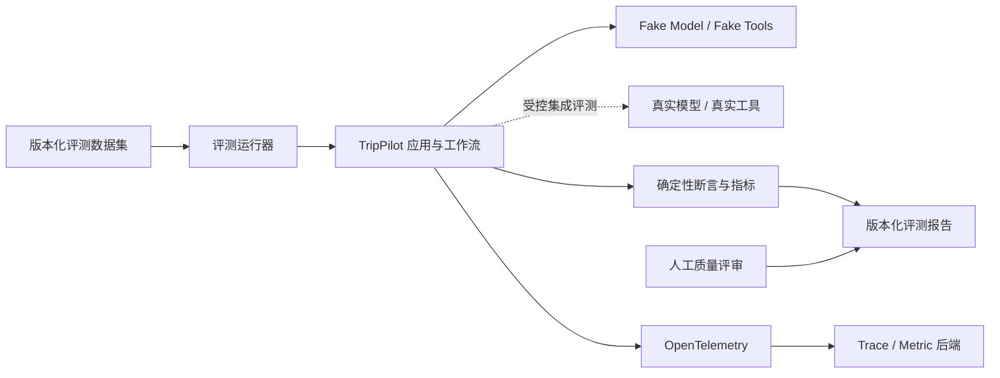

# 评测与可观测性设计

> 状态：In Review
>
> 候选基线：v1.0

评测回答“Agent 是否达到预期”，可观测性回答“这一次为什么得到这个结果”。两者共享版本标识和事件语义，但评测数据集、业务数据和运行日志相互独立。

## 总体结构



评测运行器调用与产品相同的应用用例和 Agent 工作流，不维护另一套“只用于评测”的规划逻辑。

## 评测数据布局

```text
evals/
├── datasets/
│   └── v1/
│       ├── manifest.yaml
│       ├── normal/
│       ├── clarification/
│       ├── constraints/
│       ├── tool-failures/
│       ├── modifications/
│       └── security/
├── fixtures/
│   ├── model/
│   └── tools/
├── scorers/
├── baselines/
└── reports/
```

每个场景使用稳定 ID，并包含：

- 输入消息或需求
- 固定模型与工具 Fixture
- 期望状态和错误码
- 必需与禁止的工具调用
- 硬性约束断言
- 允许的软性差异
- 来源和版本要求

真实用户输入不得直接复制进数据集。失败案例必须脱敏、重新表述并经人工确认。

## 评测模式

### 确定性回归

- Fake Model
- Fake Tools
- 固定时钟和 ID 生成器
- PostgreSQL 测试数据库或事务隔离
- 每次 PR 运行

用于 100% 硬门禁、工作流路由、错误处理和版本行为。

### 真实模型评测

- 固定 Prompt 和 Schema 版本
- 固定工具 Fixture，隔离动态外部变化
- 记录模型解析版本、Token、延迟和成本
- 在影响 Prompt、模型或工作流的变更上运行

用于需求提取、计划质量、偏好覆盖和重规划能力。

### 真实工具集成

- 固定少量城市和查询
- 允许动态结果，但验证契约、来源、时效和错误分类
- 手动、定时或发布前运行，不阻塞普通离线开发

### 人工评审

从真实模型评测结果中抽取要求数量，按可执行性、路线、个性化、清晰度和风险表达评分。

## Scorer 分层

### 代码判定

用于：

- Schema 合法性
- 状态与重规划次数
- 预算、时间、路线和版本不变量
- 工具调用集合
- 来源完整性
- 敏感信息模式

确定性结论不能使用大模型 Judge 替代。

### 规则与集合指标

- 字段 Precision / Recall
- 必要工具 Recall
- 无关工具调用率
- 未受影响日期保持率
- 兴趣覆盖率
- 延迟和成本分布

### 大模型辅助评审

只用于路线合理性、表达清晰度等难以完全代码化的维度。Judge Prompt、模型和评分理由必须版本化；最终发布结论仍由人工确认。

## Prompt 管理

```text
prompts/
├── requirement_extraction/
│   ├── v1.md
│   └── schema.json
├── plan_generation/
│   ├── v1.md
│   └── schema.json
└── replan/
    ├── v1.md
    └── schema.json
```

每个 Prompt 具有：

- 稳定名称和语义版本
- 适用工作流节点
- 输入变量与输出 Schema
- 变更说明
- 对应评测基线
- 内容哈希

Prompt 不从数据库后台临时编辑。第一版随代码发布并经过 Pull Request 评审，避免运行中的未审计变化。

## Trace 模型

一个规划任务对应一个根 Span：

```text
planning_task
├── extract_request
├── await_confirmation
├── load_planning_context
│   ├── weather.query
│   └── places.search
├── generate_candidate
│   └── model.response
├── enrich_candidate
│   ├── route.query
│   └── place.details
├── validate_candidate
├── prepare_replan
└── finalize
```

Span 属性只保存低基数、脱敏字段，例如状态、节点、候选次数、模型名、Prompt 版本、工具名、缓存命中和错误码。

城市、完整任务 ID、访问令牌、用户原文和地点列表不作为 Metric Label。

## 指标

### 业务指标

- 各结果状态比例
- 首次确认完成率
- 自动重规划率和达到上限比例
- 局部修改成功率
- `PARTIAL` 原因分布

### 性能指标

- 需求提取与完整规划延迟直方图
- 每节点和每工具延迟
- 任务队列等待时间
- 运行中任务与过期租约数量
- 数据库连接池使用率

### Agent 指标

- 模型调用、Token 和估算成本
- Schema 修复率
- 工具调用与缓存命中
- 约束失败类别
- 每任务候选计划数量

### 安全指标

- 限流拒绝
- 未授权令牌
- 越权工具请求
- Prompt 注入检测事件
- 出站访问拒绝

安全指标不得携带攻击载荷全文。

## 日志事件

JSON 日志最少包含：

- `timestamp`
- `level`
- `event_name`
- `trace_id`
- 脱敏任务引用
- `task_status`
- `workflow_step`
- `error_code`
- `duration_ms`
- 版本字段

异常只在受控服务端日志记录内部类型；用户响应使用稳定错误。生产式环境关闭框架 Debug 页面。

## 版本与复现

每份评测报告记录：

- Git Commit
- 需求和架构基线标签
- 数据集版本
- Prompt 与 Schema 哈希
- 模型请求名与实际解析版本
- 工具与 Fixture 版本
- Python 锁文件哈希
- 配置档案
- 指标、失败场景和人工评分

随机性配置必须记录。无法完全复现的供应商行为通过固定 Fixture 和统计回归控制。

## 发布门禁

1. 确定性硬门禁全部通过。
2. 需求定义的质量指标达到阈值。
3. 性能与成本报告满足目标。
4. 不存在未解释的显著回归。
5. 人工评审达到要求。
6. 评测报告关联当前候选提交。

报告本身不包含密钥、令牌或未脱敏用户数据。
