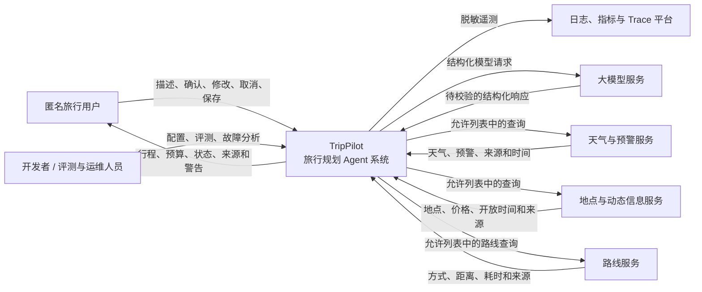

# 系统上下文

> 状态：In Review
>
> 候选基线：v1.0

系统上下文定义 TripPilot 的责任边界、交互角色、外部系统和信任边界。本文件只描述“系统与谁交互”，不提前决定服务端内部模块或具体供应商。

## 上下文图

## 人员角色

### 匿名旅行用户

- 提供并确认旅行需求。
- 查看规划状态、行程、预算、来源和不确定项。
- 取消任务或提交局部修改。
- 在启用匿名保存时持有行程访问 ID，并承担妥善保管责任。

用户不能直接调用模型、外部旅行服务、内部数据库或未注册工具。

### 开发者、评测与运维人员

- 配置模型、工具、Prompt、资源上限和运行环境。
- 运行自动测试、Agent 评测和故障注入。
- 根据脱敏日志、指标和 Trace 分析问题。
- 不能通过普通日志读取完整旅行输入、完整行程 ID 或密钥。

## TripPilot 负责

- 接收、提取、校验和确认用户需求。
- 维护规划任务状态与资源预算。
- 决定何时调用模型和允许列表中的工具。
- 校验模型与工具返回的数据。
- 执行确定性约束检查和有限自动重规划。
- 管理行程版本、匿名访问、保留和删除。
- 生成用户可见的来源、不确定项和可操作错误。
- 产生脱敏、可关联且可复现的遥测事件。

## TripPilot 不负责

- 保证外部天气、地点、价格、开放时间或路线数据永久正确。
- 允许大模型绕过业务规则或直接写入持久化数据。
- 代表用户预订、支付、购买、发送消息或执行其他外部写操作。
- 提供账号登录、跨城市复杂规划或多 Agent 协作。
- 输出或保存模型隐藏推理链。

## 外部系统契约

| 外部系统 | TripPilot 发送 | TripPilot 接收 | 失败责任 |
| --- | --- | --- | --- |
| 大模型服务 | 最小必要上下文、版本化 Prompt、结构化输出要求 | 待校验的需求或候选计划 | TripPilot 负责超时、错误分类、Schema 校验和有限重试 |
| 天气与预警服务 | 城市、日期范围 | 天气、预警、来源、查询时间 | TripPilot 负责缓存时效、降级和 `UNKNOWN` |
| 地点与动态信息服务 | 城市、兴趣、地点条件 | 地点标识、坐标、价格、开放时间、来源 | TripPilot 负责标准化、候选为空和不可信文本隔离 |
| 路线服务 | 标准化起终点、交通偏好 | 距离、耗时、交通方式、来源 | TripPilot 负责超时、未知路线和缓存策略 |
| 日志、指标与 Trace 平台 | 脱敏结构化事件和指标 | 查询与告警能力 | TripPilot 负责数据最小化，不把平台当作业务数据源 |

具体服务商、协议和 SDK 属于后续技术选型，但任何实现都必须满足对应端口契约。

## 信任边界

### 用户输入

用户输入是不可信数据，必须进行长度、格式、范围和业务合法性校验。用户提供的 URL、地点描述或自然语言不得直接转换成任意网络请求。

### 模型响应

模型响应是不可信候选数据。只有经过 Schema、引用完整性和确定性业务规则校验后，才可以形成候选计划或用户可见结果。

### 工具与网页内容

工具返回的描述文本属于不可信外部内容，只能作为数据使用。其中出现的指令不得修改系统规则、工具权限、Prompt 或密钥访问范围。

### 匿名行程 ID

行程 ID 是访问凭证。客户端和服务端都不得将完整 ID 写入普通日志、错误响应、分析事件或公开 URL 参数之外的不必要位置。

### 遥测数据

遥测平台只接收脱敏事件。业务行程与版本的权威数据不能依赖日志或 Trace 恢复。

## 关键数据流

1. 用户输入进入 TripPilot 后先形成需求草稿。
2. 需求完整并经用户确认后，工作流才能调用正式规划能力。
3. TripPilot 通过工具端口取得带来源和时间的数据。
4. 大模型基于已确认需求和工具结果生成候选计划。
5. TripPilot 校验 Schema，并由领域规则检查预算、时间、路线、天气和强度。
6. 合格或允许降级的结果形成不可变行程版本。
7. 用户只接收可展示计划、明确失败或需要决策的状态。
8. 全过程产生脱敏事件，用于评测、成本分析和故障定位。

## 待后续设计回答

- 客户端与服务端是如何部署和通信的？
- 服务端内部有哪些模块，依赖方向是什么？
- 长任务采用哪种执行与状态持久化方式？
- 模型、工具和持久化端口的具体 Schema 是什么？
- 哪些查询可以安全并发，取消信号如何传播？
